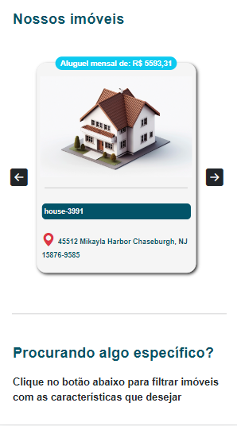
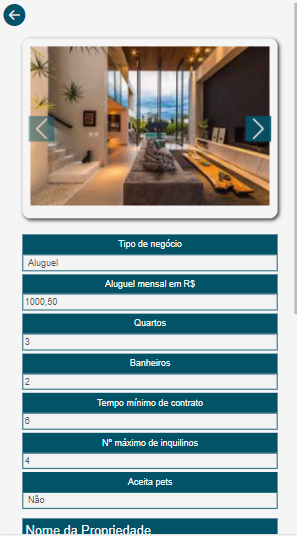

# Imob Client


[](https://lbesson.mit-license.org/)

Um simples sistema responsivo projetado para imobiliárias. O projeto apresenta os imóveis disponíveis da empresa, além, de permitir a inserção, atualização e deleção. Este sistema consome a API REST [Imob API](https://github.com/Hiago-Laureano/imob-api).

<h1 align="center">
    
    
    
</h1>

## Requisitos


### Para instalar as dependências, execute o seguinte comando:
```
npm install
```

### Para executar o projeto, execute o seguinte comando:
```
npm run serve
```

### Para compilar a aplicação para produção, execute o seguinte comando:
```
npm run build
```